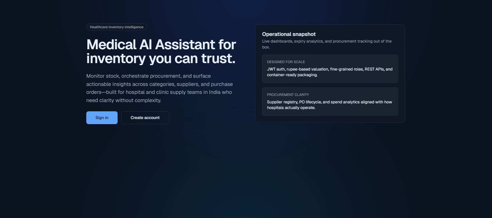
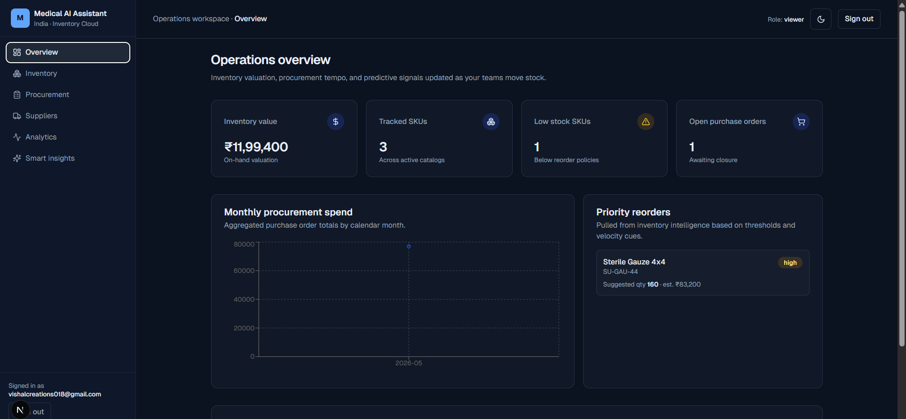
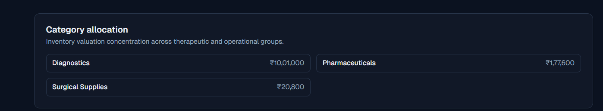
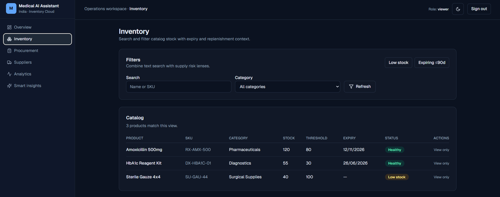
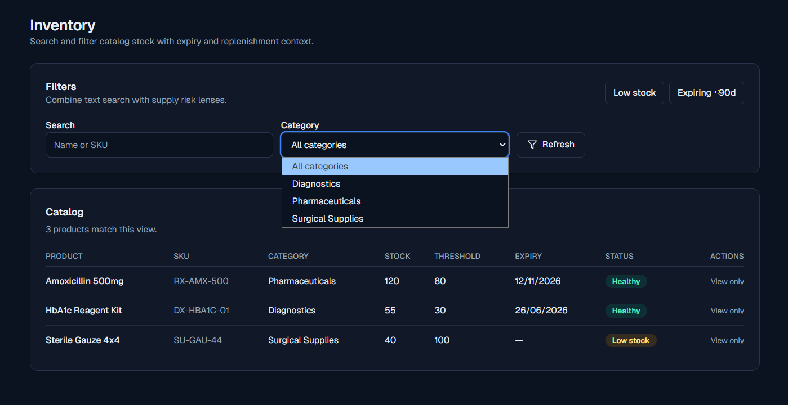
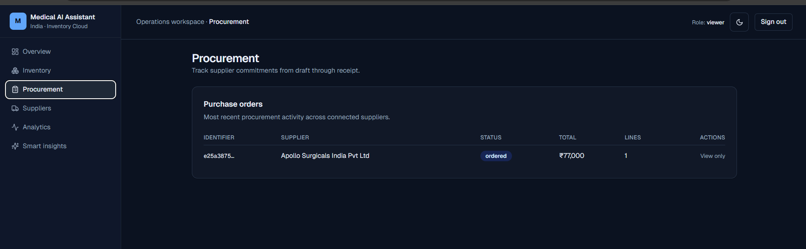
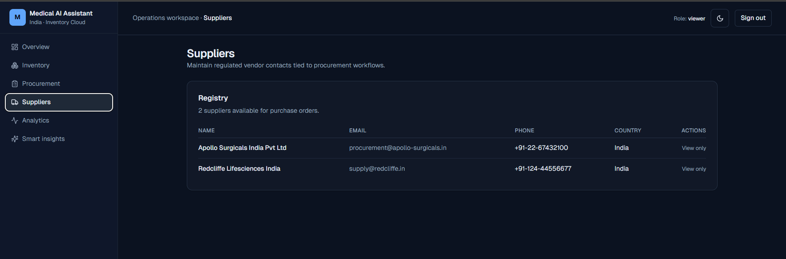
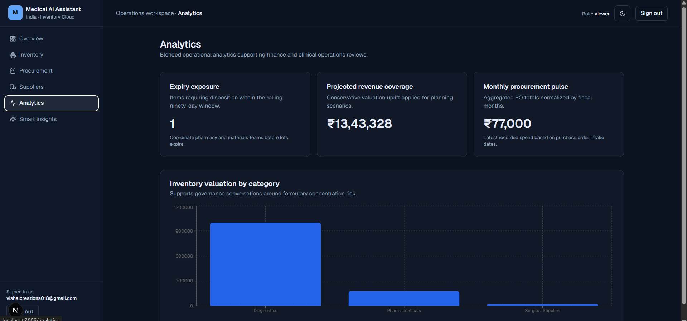
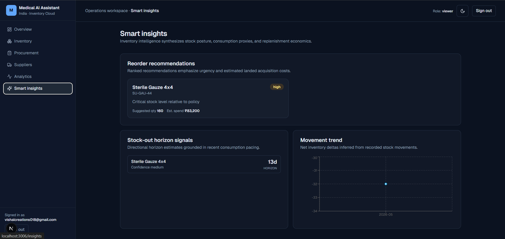
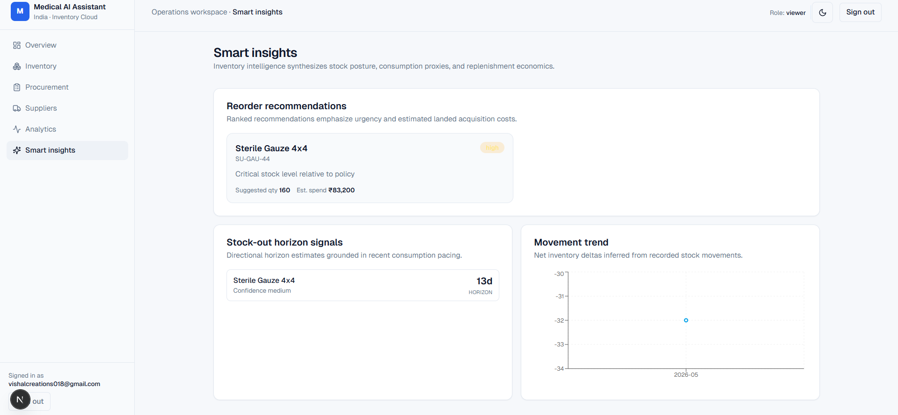

````markdown
# Medical AI Assistant

Medical AI Assistant is a modern healthcare inventory and procurement SaaS platform designed for hospitals, medical institutions, and healthcare operations teams. The platform focuses on inventory monitoring, procurement workflows, supplier management, analytics, and AI-powered operational insights through a scalable full-stack architecture.

The project was developed to demonstrate scalable software engineering practices, modern frontend-backend integration, REST API architecture, responsive SaaS UI development, and modular system design.

---

# Core Features

## Authentication & Access Control
- User Registration
- Secure Login System
- JWT Authentication
- Session Persistence
- Protected Routes

## Inventory Management
- Add Medical Products
- Edit Inventory Items
- Delete Inventory Records
- Product Quantity Tracking
- Expiry Date Monitoring
- Low Stock Alerts
- Product Categorization

## Procurement Workflow
- Procurement Request Management
- Order Tracking
- Supplier Handling
- Purchase Workflow Monitoring
- Status-Based Procurement Updates

## Supplier Management
- Supplier Information Management
- Supplier Listing Dashboard
- Procurement Association
- Vendor Tracking

## Smart AI Insights
- Low Stock Predictions
- Smart Reorder Suggestions
- Inventory Trend Analysis
- Usage-Based Insights
- AI-Driven Operational Recommendations

## Dashboard Analytics
- Inventory Statistics
- Procurement Analytics
- Revenue & Usage Charts
- Stock Overview
- Product Performance Insights

## Search & Filtering
- Product Search
- Category Filtering
- Expiry Filtering
- Procurement Status Filtering

## UI / UX
- Modern SaaS Dashboard
- Responsive Design
- Sidebar Navigation
- Dark / Light Theme
- Interactive Components
- Toast Notifications
- Loading States
- Empty States
- Mobile Responsive Layout

---

# Technology Stack

| Technology | Purpose |
|---|---|
| Next.js 15 | Frontend Framework |
| ReactJS | UI Development |
| TypeScript | Type Safety |
| Tailwind CSS | Styling |
| Shadcn UI | UI Components |
| GoLang | Backend Services |
| Gin Framework | REST APIs |
| SQL Architecture | Data Layer |
| Redis Architecture | Caching Layer |
| Docker | Containerization |
| JWT | Authentication |
| Git & GitHub | Version Control |

---

# System Architecture

```bash
Medical-AI-Assistant/
│
├── frontend/
│   ├── app/
│   ├── components/
│   ├── services/
│   ├── hooks/
│   ├── styles/
│   └── lib/
│
├── backend/
│   ├── cmd/
│   ├── handlers/
│   ├── middleware/
│   ├── repositories/
│   ├── services/
│   ├── routes/
│   ├── models/
│   └── utils/
│
├── database/
│   ├── schema/
│   └── migrations/
│
├── infrastructure/
│   ├── docker/
│   └── nginx/
│
├── screenshots/
├── docker-compose.yml
├── README.md
└── package.json
```

---

# Installation & Setup

## Prerequisites

Install:
- Node.js
- GoLang
- Docker Desktop

---

# Clone Repository

```bash
git clone YOUR_GITHUB_REPOSITORY_LINK
```

Move into the project directory:

```bash
cd Medical-AI-Assistant
```

---

# Frontend Setup

```bash
cd frontend
npm install
npm run dev
```

Frontend runs at:

```bash
http://localhost:3000
```

---

# Backend Setup

```bash
cd backend
go mod tidy
go run cmd/main.go
```

Backend runs at:

```bash
http://localhost:8080
```

---

# Docker Setup

Run complete application:

```bash
docker compose up --build
```

---

# Application Screenshots

## Landing Page



---

## Main Dashboard



---

## Dashboard Analytics



---

## Inventory Management



---

## Inventory Tracking



---

## Procurement Workflow



---

## Supplier Management



---

## Analytics Overview



---

## Smart AI Insights



---

## Light Theme



---

# API Modules

## Authentication APIs
- Login
- Register
- JWT Validation

## Inventory APIs
- Add Product
- Update Product
- Delete Product
- Fetch Inventory

## Procurement APIs
- Create Procurement Request
- Update Procurement Status
- Procurement Analytics

## Supplier APIs
- Add Supplier
- Update Supplier
- Fetch Supplier Data

## Analytics APIs
- Dashboard Metrics
- Smart Insights
- Inventory Reports

---

# Future Enhancements

- Multi-Tenant Architecture
- Real-Time Notifications
- Cloud Deployment
- AI Forecasting Expansion
- Advanced Procurement Automation
- Role-Based Team Management
- Exportable Reports
- Email Notifications

---

# Project Highlights

- Modern Healthcare SaaS Architecture
- Full-Stack Frontend & Backend Integration
- REST API Driven Design
- Responsive Dashboard System
- Smart Inventory Insights
- Scalable Modular Code Structure
- Dockerized Deployment Workflow
- Premium SaaS UI/UX

---

# Developer

Medical AI Assistant Development Project

GitHub Repository:
Add your GitHub repository link here.

---

# License

Developed for educational, portfolio, and technical assessment purposes.
````
